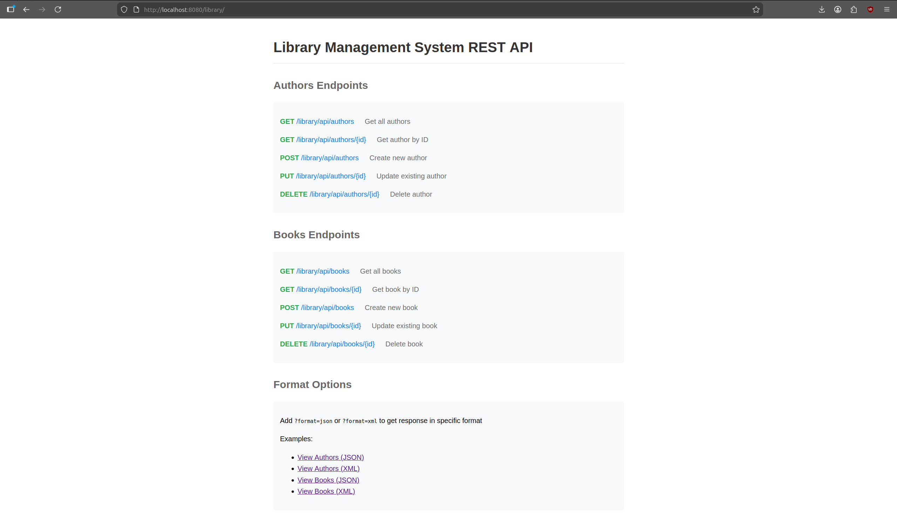

# Practical Work #3

Почему SpringREST вместо JAX-RS?

1. **Интеграция с экосистемой Spring:**
    - Бесшовная интеграция с существующими Spring компонентами
    - Единый подход к конфигурации
    - Согласованное управление зависимостями

2. **Простота использования:**
    - Меньше конфигурации
    - Интуитивно понятные аннотации
    - Автоматическая сериализация/десериализация

3. **Богатая функциональность:**
    - Встроенная поддержка контент-негоциации
    - Гибкая обработка исключений
    - Расширенная валидация

## Реализованы следующие страницы
### Начальная страница

